# WandrQuest

**A live, multiplayer "walk-around" quiz game for classrooms, training days, and events.**

Players join on their phones, explore a neon top-down map, walk up to holographic characters (NPCs) to answer scenario questions, fight over territory with their team, and climb a live leaderboard projected on the big screen — Kahoot meets a tiny cyberpunk Pokémon world.


---

### 🌐 Live site: **https://wandrquest.vercel.app**

### ▶️ Live demo (always on)

| | |
|---|---|
| **Landing page** | https://wandrquest.vercel.app |
| **Play the demo** (mobile-friendly) | https://wandrquest.vercel.app/game?room=DEMO |
| **Projector view** | https://wandrquest.vercel.app/master?room=DEMO |
| **Host console** | https://wandrquest.vercel.app/host |

The always-on demo room (`DEMO`) is themed as a **Classroom** — Sharing center, Teacher, Students, and Table, along with NPCs to interact with.

---

## Screenshots

**Landing**


**Host sign-up** — password strength meter, confirm field, visually distinct from sign-in


**Host dashboard** — create games (each with a unique room code), edit, share player link, project, delete


**Projector / master view** — live top-down map with zones, obstacles, player positions, leaderboard and host controls


**Player view** (mobile) — neon holo-grid world, follow camera, virtual joystick, minimap, role badge, XP rank


**Player role selection** — pick a role at join time, each with a unique passive bonus and team colour


**Talking to an NPC** — holographic question terminal

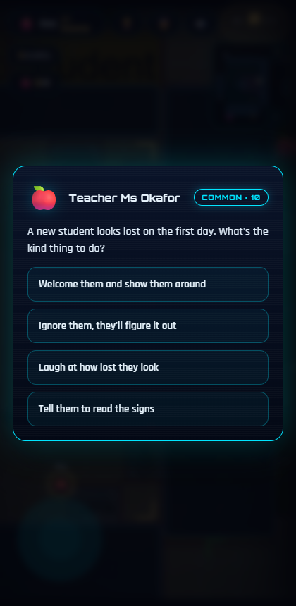

**Answering correctly** — instant feedback + points

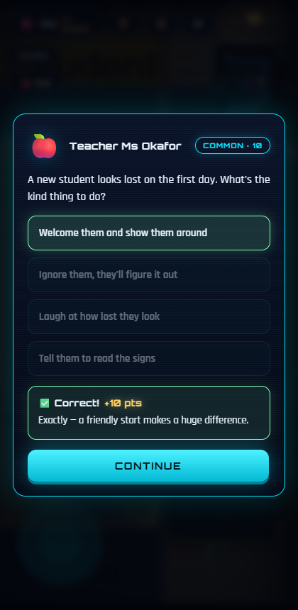

**Projector — final standings** — pushed to every screen when the host ends the game

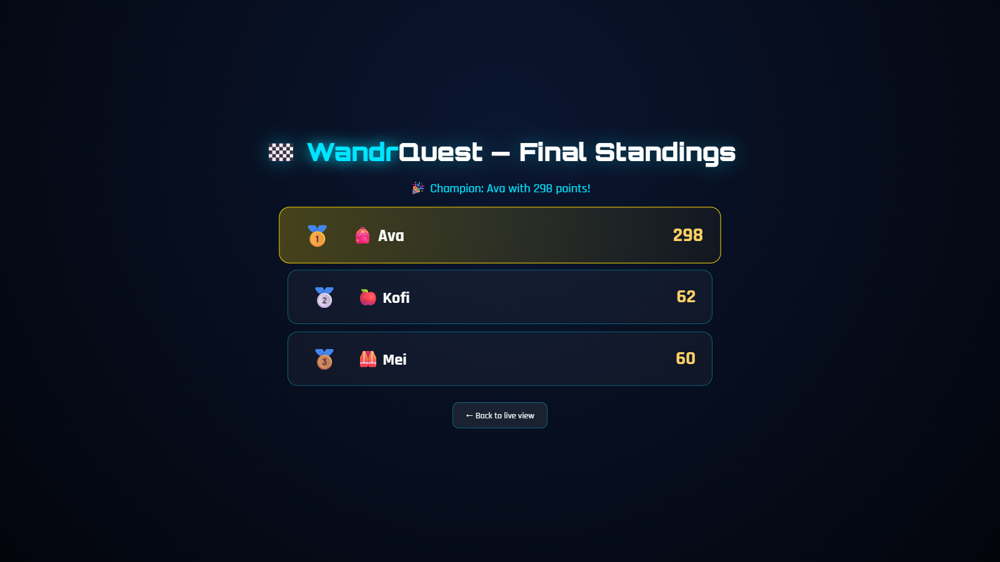

**Editor — NPCs tab** — two-pane layout: character list rail + full properties panel; drag NPCs on the map


**Editor — Map tab** — drag/resize zones & obstacles, theme picker, background image upload, aspect ratio control


**Editor — Roles tab** — define roles, emoji, description and passive bonus type


**Starter templates** — 5 ready-made scenarios with real floor-plan backgrounds (School shown here)


---

## Features

### Multi-room hosting
Hosts sign up, create rooms (each gets a short **room code**), and run isolated live sessions. Many hosts, many simultaneous games — each room's players, scores, content, and events are completely separate. Players join with **no account** — just a code, a name, and a role pick.

### Visual editor (no rebuild needed)
Everything is authored in the browser editor and published live to every player the moment you save. No redeploy.

- **NPCs** — add/remove characters, write dialogue, 4 answer options (mark the correct one), per-answer feedback, tier (Common / Rare / Elite-timed / Boss co-op), points value, zone assignment, and role bonus target.
- **Map** — drag characters to position them on a scaled map preview. A dashed viewport guide shows the camera window so you size things correctly.
- **Zones** — add, drag, resize, rename, and recolour the map regions that appear on the projector and minimap.
- **Obstacles** — furniture and walls with real AABB collision — players walk around them, they appear on the minimap and projector.
- **Themes** — Grid / Campus / Factory / Space colour palettes applied to floor and grid.
- **Background image** — paste a URL or upload an image (stored in Supabase Storage), with adjustable opacity.
- **Aspect ratio** — reshape the world (Tall / Portrait / Square / Landscape / Match background image) so backgrounds fill the frame without stretching or cropping.
- **Roles** — fully editable: emoji, label, description, and passive bonus type (role-match bonus, teammate bonus, or none).
- **Branding** — app name, organisation name, floor title, tagline — everything on every screen updates.

### Scenario templates
Five built-in templates to start from — each with a themed floor-plan background, pre-written questions, zones, obstacles, and roles:

| Template | Setting | Roles |
|---|---|---|
| 🏫 School | Classrooms, Science Lab, Library, Playground | Student · Teacher · Prefect |
| 🏢 Office | Reception, Meeting Rooms, Open Desks, Break Room | Staff · Manager · Intern |
| 🏥 Hospital | Reception, Wards, Pharmacy, First Aid | Nurse · Doctor · Volunteer |
| 🏛️ Museum | Entrance, Art Gallery, History Hall, Gift Shop | Visitor · Curator · Guide |
| 🛍️ Shopping Mall | Entrance, Fashion, Food Court, Cinema | Shopper · Staff · Security |

Load any template in the editor, customise the questions and layout, and save — it goes live instantly.

### Live session controls (projector)
- **Open / lock joining** — control when players can enter mid-game.
- **2× points boost** — 60-second multiplier event.
- **Speed round** — 30-second timed pressure event.
- **Surge / Spotlight / Frenzy** — the same random world events players trigger organically, host-triggerable on demand.
- **Boss spawn** — co-op challenge: 3+ players must gather at the centre to unlock a high-stakes question.
- **End game** — push the final leaderboard to all screens.
- **New game** — clear all players and scores to run again.
- **Editable session timer** — type any duration (minutes), persists per browser; Reset returns to your chosen length.
- **Hide/show QR join card** — dismiss it once everyone's joined so it stops covering the live map.

### Question mechanics
- **Common** — standard, always available.
- **Rare** — higher points, standard format.
- **Elite (timed)** — configurable countdown (e.g. 15 s), extra points for speed.
- **Boss (co-op)** — locked until 3+ players gather; unlocked by the host.
- **Role bonuses** — answering a question tagged to your role earns a percentage bonus (e.g. Teacher gets +25% on teaching questions). Teammate bonus rewards players whose teammate answered right just before them.

---

## How it works

```
index.html        Landing page
/host             Host console  — auth, create/manage rooms
/game             Player view   — Phaser 3 + nipple.js (joins by room code)
/master           Projector     — Canvas2D live map + leaderboard + controls
/editor           Editor        — drag-and-drop authoring (per room, host-gated)
```

- **Frontend** — plain HTML/JS, no build step, no framework. Served as static files on **Vercel**.
- **Backend** — **Supabase** (Postgres + Realtime + Auth + Storage). A `rooms` table holds each game's full config as JSONB. `players` and `game_events` are scoped by `room_id`. Realtime subscriptions are filtered per room so rooms never see each other's traffic.
- **Auth + RLS** — hosts authenticate via Supabase Auth (email + password). Row-Level Security enforces ownership: only a room's host can edit its config or fire events (boss / end / 2×). Players can only join rooms that are open. Players never create accounts.
- **Config flow** — the editor PATCHes `rooms.config`; the player view and projector read it on load and subscribe for changes. Edits go live in seconds without any redeploy.
- **Scaling** — Vercel is a CDN (zero server overhead for static files). Supabase Realtime handles concurrent player connections. 100 concurrent player inserts tested at ~0.3 s each.

---

## Tech stack

**Phaser 3** · **nipple.js** · **Supabase** (Postgres · Realtime · Auth · Storage · RLS) · **Vercel** · vanilla JS (no framework, no bundler, no build step)

---

## ✅ Recently shipped

### ⚡ Neon overhaul — new look, new systems

The player and projector views were fully reworked: a glossy neon "holo-grid" look (procedural
circuit floor, holographic NPC pods, glowing avatars with light trails, particles, camera shake/
zoom, synthesised sound effects — all generated in-browser, still zero image or audio assets and
zero build step) plus four new gameplay systems layered on top of the original loop.

| System | How it works |
|---|---|
| 🏴 **Zone Control** | Answering an NPC claims its zone for your role's team. Whichever team has the most claims owns the zone — it tints to their colour on the map, minimap and leaderboard, and pays that team +8 pts per zone every 30 s. |
| 🟢 **Power-up orbs** | Orbs spawn near players every ~30s: ⚡ Overclock (next correct answer ×2), 💨 Dash (+45% speed), 🛡️ Streak Shield (survive one miss), 📡 Radar (reveal targets). |
| ✦ **XP ranks** | Score doubles as XP — Rookie → Operative → Specialist → Veteran → Elite → Legend — with a rank-up splash and an aura-colour upgrade on your avatar. |
| 👾 **Boss 2.0** | A dramatic "threat detected" intro, then a shared team **Boss Integrity** bar — every player's correct answer chips away at it, and defeating it pays everyone who joined the fight a +50 Team Takedown bonus. |

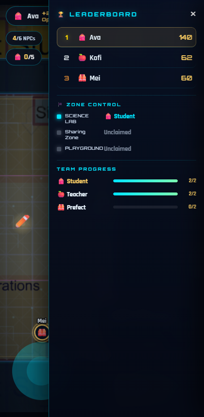
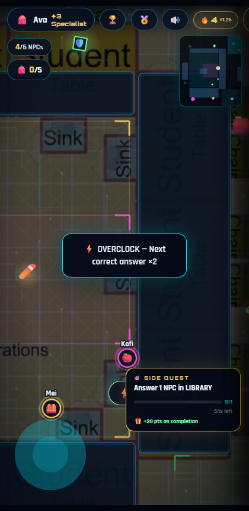
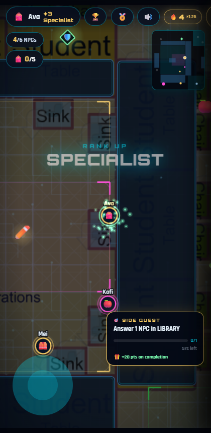
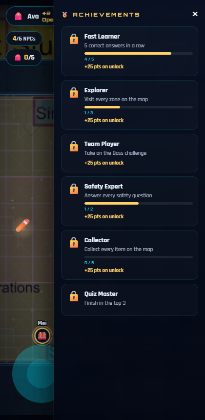

The projector view also got two host-requested quality-of-life fixes: the QR join card can be
**hidden** (it was blocking the live map) with one click, and the **session timer is now editable**
(type any duration in minutes) instead of being fixed at 15:00 — both preferences persist per browser.

### 📱 QR Code Joining

Players join instantly by scanning a QR code — no typing a room code.

* ✅ Unique QR code generated for every room
* ✅ Works with any phone camera (encodes the direct join link)
* ✅ Scanning auto-fills the room and goes straight to name/role
* ✅ Shown big on the **projector** (with the room code) and in a **host-dashboard** modal (copy-link + per-room)

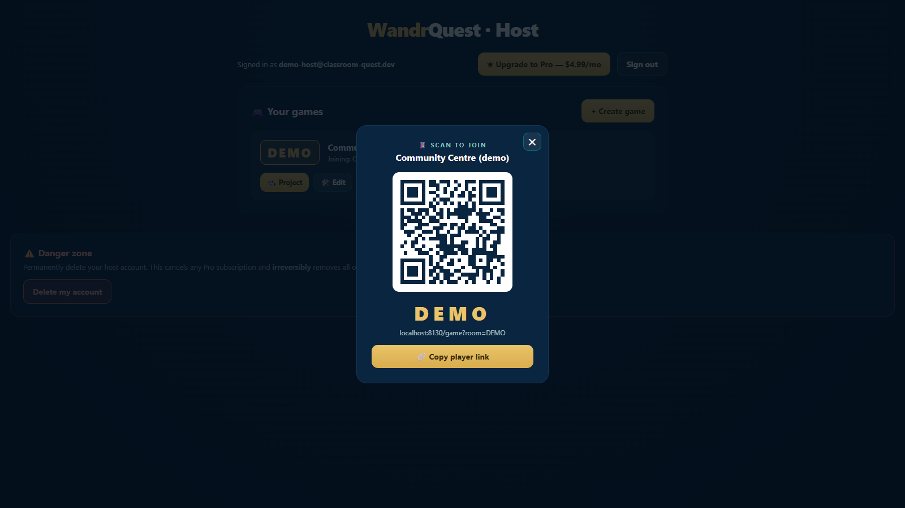

*(The projector also shows the live join card + room code — see the projector screenshot above.)*

### 🏅 Achievement System

Unlockable achievements reward exploration, teamwork, and learning.

| Achievement   | Requirement                           |
| ------------- | ------------------------------------- |
| ⚡ Fast Learner  | Answer 5 questions correctly in a row |
| 🧭 Explorer      | Visit every zone on the map           |
| 🤝 Team Player   | Take on the Boss challenge            |
| 🛡️ Safety Expert | Answer every question tagged `safety` |
| 🎒 Collector     | Collect every item on the map         |
| 👑 Quiz Master   | Finish in the top 3                   |

* ✅ Live unlock notifications during gameplay
* ✅ Optional leaderboard bonus points per achievement
* ✅ End-of-game achievement summary (earned vs locked)
* ✅ Question tagging (`category`) in the editor powers Safety Expert

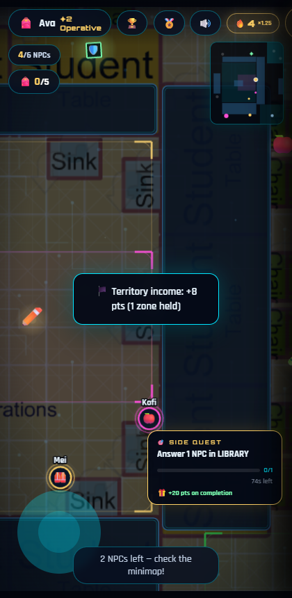
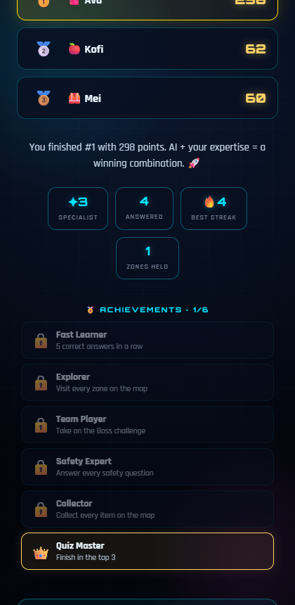

### 📊 Analytics Dashboard (`/analytics`, host-only)

Actionable insights after each session, secured by RLS to the room's host.

* ✅ Overall accuracy, players, completion rate, average response time
* ✅ Per-question accuracy + response time (hardest questions first)
* ✅ Role performance comparison and zone activity
* ✅ Activity **heatmap** of where questions were answered
* ✅ **CSV export** and **PDF report** (print) · session switcher + history across your games

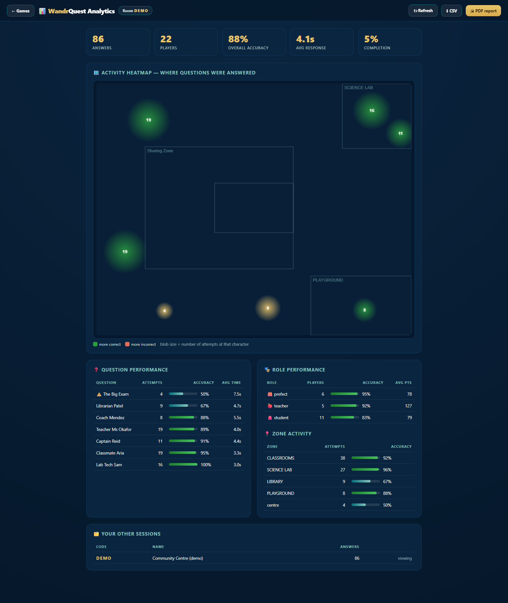

---

## 🚧 Roadmap

### 🎮 Expanded Gameplay Mechanics

* ✅ **Item collection quests** — collectible items on the map, live counter, bonus points, and the Collector achievement (the floating items and 🎒 counter are visible in the projector and player screenshots above)
* ✅ **Team-based objectives** — Zone Control (see "Neon overhaul" above)
* ✅ **Random world events** — Speed Surge, Gold Rush, Spotlight, Answer Frenzy auto-fire every ~90s and are also host-triggerable from the projector
* ✅ **Timed missions** — auto-generated side quests (zone sprints, streak runs, item grabs) with a countdown banner and bonus reward
* Trading & resource sharing · NPC dialogue trees · unlockable map areas · seasonal challenges
